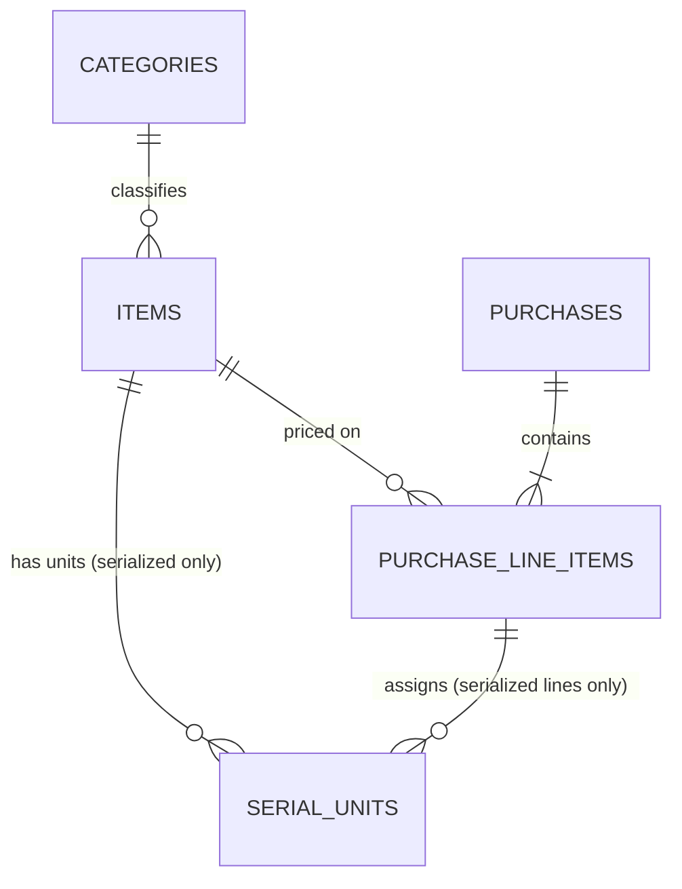

# Database Schema & Business Logic — Milestone 2

Scope check against `../../CLAUDE.md`'s Build status & decisions: Milestone 2 is
"core data model + business logic (Postgres schema + Python), NO external
integrations" — schema + business logic, verified against hand-crafted test
purchases and unit tests only. No web UI, no Google Drive, no OCR, no
eBay ingestion, no sale/depletion, no login. This doc covers exactly that
slice, same review-before-build spirit as Milestone 1's design pass and as
Project-Noctrowl's own `docs/design/schema-design.md` (sibling project,
referenced here purely for documentation conventions — none of its
business content applies to this project).

## Migrations

**Approach chosen: plain, numbered `.sql` files, applied in order by
`scripts/run_migrations.py`, tracked in a `schema_migrations` table.**

Considered and rejected: Alembic (too much machinery for a from-scratch
schema with no migration history to reconcile yet — nothing to
autogenerate against); bare SQLAlchemy-Core `metadata.create_all()`
(Project-Noctrowl's own choice, works well there, but two of this
project's invariants — the reconciliation trigger and the "purchase must
have at least one line" trigger — are genuine trigger DDL that reads more
clearly as plain SQL than as SQLAlchemy `DDL()` constructs; keeping schema
definition and business-logic queries in separate layers, rather than one
SQLAlchemy `Table` layer serving both, also keeps `inventory/*.py` free to
use plain parameterized SQL via `sqlalchemy.text()` without an ORM/Core
table-metadata dependency).

Each file (`migrations/001_initial_schema.sql`, and any future
`002_...`, `003_...`) is idempotent (`CREATE TABLE IF NOT EXISTS`,
`CREATE OR REPLACE FUNCTION`, `DROP TRIGGER IF EXISTS` before
`CREATE TRIGGER`) and applied inside its own transaction, recorded in
`schema_migrations` by filename so a re-run never re-applies anything.
`inventory/db.py::run_migrations()` is the real logic;
`scripts/run_migrations.py` is a thin CLI wrapper reading `DATABASE_URL`
from the environment (never hardcoded — see `.env.example`).

## Design principles

- **Money is `NUMERIC`, never `float`** — `NUMERIC(20, 2)` for IDR/whole-
  currency amounts, `NUMERIC(14, 3)` for weight-in-kg supporting inputs,
  `NUMERIC(18, 6)` for the nullable FX-rate groundwork field. Every
  computation in `inventory/allocation.py` uses `decimal.Decimal`
  internally and returns whole-rupiah `int`s — the same "never float"
  discipline CLAUDE.md requires of Project-Noctrowl's ledger, applied here
  too, even though this schema has no journal/debits-credits concept of
  its own.
- **Currency is explicit on the purchase header** (`currency`, defaulting
  `'IDR'`, plus a nullable `fx_rate_to_idr` groundwork field) — every real
  purchase so far (and every purchase the mockup ever demonstrates) is
  IDR-only, so the FX field is intentionally not wired into any
  computation yet, just present so a future non-IDR purchase doesn't need
  a schema migration to add it.
- **Identity mode is a property of the item, never the category** —
  `items.identity_mode` is a plain column with no relationship to
  `category_id` anywhere in the schema or in `inventory/*.py`'s logic.
- **Categories are a data table, not a hardcoded enum** — `categories` is
  seeded with the 5 confirmed rows (`inventory/seed.py`) but nothing in
  the schema or business logic assumes exactly 5; a 6th category is a
  plain `INSERT`.
- **The reconciliation invariant is enforced at the database level, as a
  real structural backstop — not just an application-level check before
  insert.** `inventory/purchases.py::save_purchase()` computes and checks
  this in Python first (fast, clear failure, before a single row is
  written), and a Postgres `DEFERRABLE INITIALLY DEFERRED` constraint
  trigger re-checks the same thing at COMMIT time — the same two-layer
  pattern Project-Noctrowl's `ledger/posting.py` uses for its own
  debits-=-credits invariant (see that project's module docstring, quoted
  here only for the pattern, not the business content).
- **Uniqueness is enforced twice, independently, matching the brief's
  explicit instruction**: a real DB-level unique index (`ux_items_sku`,
  `ux_serial_units_serial_id`) AND an application-level pre-insert check
  (`inventory/uniqueness.py`) that produces a specific, actionable error
  (`DuplicateSkuError` / `DuplicateSerialError`) rather than relying on
  the SKU/serial generators alone to avoid collisions. Both layers are
  exercised in `tests/test_purchases.py` — including a raw-SQL test that
  bypasses `save_purchase()` entirely to prove the DB index itself
  rejects a duplicate, not just the application check.
- **Every table that plausibly needs one keeps groundwork fields for
  something not built yet** — `purchases`' invoice/OCR fields,
  `serial_units.photo_reference` — nullable, unused by any computation in
  this milestone, present so a later ingestion milestone is additive.

## Entity-relationship diagram

## Tables

### `categories`
The 5 confirmed categories (TCG, Watches, Automotive, Toys & Collectibles,
Others) — a data table, not a CHECK-constraint enum, so it's genuinely
extensible (see Design principles above).

| Column       | Type    | Notes                                             |
|--------------|---------|----------------------------------------------------|
| `id`         | SERIAL PK |                                                  |
| `code`       | TEXT UNIQUE | e.g. `'TCG'`, `'TOYS_COLLECTIBLES'`             |
| `name`       | TEXT    | display name, e.g. `'Toys & Collectibles'`        |
| `sku_prefix` | TEXT UNIQUE | e.g. `'TCG'`, `'WATCH'`, `'AUTO'`, `'TOY'`, `'OTH'` |
| `created_at` | TIMESTAMPTZ |                                                |

### `items`
The SKU catalog.

| Column          | Type    | Notes                                          |
|-----------------|---------|-------------------------------------------------|
| `id`            | SERIAL PK |                                               |
| `sku`           | TEXT UNIQUE (`ux_items_sku`) | never inferred/generated without the uniqueness check gating it |
| `name`          | TEXT    |                                                 |
| `category_id`   | FK -> `categories.id` |                                   |
| `identity_mode` | TEXT CHECK IN (`'fungible'`, `'serialized'`) | a property of the item, never the category |
| `created_at`    | TIMESTAMPTZ |                                             |

### `purchases`
The header. `purchase_date` is the **booking point** — on-hand stock/cost
books at time of payment, not physical receipt (matches Project-
Noctrowl's own COGS-timing convention, per CLAUDE.md's Build status &
decisions).

| Column                    | Type | Notes |
|---------------------------|------|-------|
| `id`                      | SERIAL PK | |
| `purchase_ref`            | TEXT UNIQUE | auto-generated `PUR-{year}-{4-digit seq}`, sequence scoped per calendar year |
| `purchase_date`           | DATE NOT NULL | the booking point |
| `vendor_description`      | TEXT NOT NULL | |
| `total_amount_paid`       | NUMERIC(20,2) | what the reconciliation invariant checks every line against |
| `currency`                | TEXT, default `'IDR'` | |
| `fx_rate_to_idr`          | NUMERIC(18,6), nullable | groundwork only — not exercised by any real/test purchase yet |
| `shipping_mode`           | TEXT CHECK IN (`none`,`manual`,`pooled`) | |
| `pooled_shipping_total` / `pooled_shipping_method` | nullable, required together iff `shipping_mode='pooled'` (CHECK) | |
| `lump_sum_active`         | BOOLEAN | |
| `lump_sum_total` / `lump_sum_method` | nullable, required together iff `lump_sum_active` (CHECK) | scoped to exactly ONE group per purchase (design doc Open Question 8) |
| `invoice_document_ref`    | TEXT, nullable | groundwork |
| `invoice_ocr_status`      | TEXT CHECK IN (`parsed`,`needs_review`), nullable | groundwork |
| `invoice_parsed_fields`   | JSONB, nullable | groundwork |
| `created_at`              | TIMESTAMPTZ | |

### `purchase_line_items`

| Column | Type | Notes |
|--------|------|-------|
| `id` | SERIAL PK | |
| `purchase_id` | FK -> `purchases.id` ON DELETE CASCADE | |
| `item_id` | FK -> `items.id` | |
| `quantity` | INTEGER CHECK > 0 | whole units only in this build |
| `pricing_mode` | TEXT CHECK IN (`direct`,`lumpsum_group`) | |
| `price_entry_mode` / `price_value` | nullable, required together iff `pricing_mode='direct'` (CHECK) | `price_entry_mode` is `'per_unit'` or `'total'` — two views of one true value (see Business logic below) |
| `lumpsum_weight_kg` / `lumpsum_value` | nullable | only the field matching the purchase's `lump_sum_method` is ever populated |
| `ships_separately` | BOOLEAN | opt-out of a `pooled` shipping split |
| `manual_shipping_amount` | NUMERIC(20,2), nullable | used when `shipping_mode='manual'`, or when `pooled` + `ships_separately` |
| `shipping_weight_kg` | NUMERIC(14,3), nullable | used for `pooled` + `by_weight` when not shipping separately |
| `allocated_item_cost` / `shipping_share` / `line_total` | NUMERIC(20,2) NOT NULL | final computed figures; `line_total = allocated_item_cost + shipping_share` (CHECK) |
| `created_at` | TIMESTAMPTZ | |

### `serial_units`
One row per physical unit, for serialized items only.

| Column | Type | Notes |
|--------|------|-------|
| `id` | SERIAL PK | |
| `item_id` | FK -> `items.id` | |
| `serial_id` | TEXT UNIQUE (`ux_serial_units_serial_id`) | |
| `acquired_cost` | NUMERIC(20,2) CHECK >= 0 | |
| `purchase_line_item_id` | FK -> `purchase_line_items.id` ON DELETE CASCADE | source purchase line reference |
| `status` | TEXT CHECK IN (`'on_hand'`) | always `'on_hand'` in this build — a real column now (not inferred) so a future sale-side-depletion milestone widens this CHECK rather than adding a column |
| `photo_reference` | TEXT, nullable | groundwork — no real file storage built |
| `created_at` | TIMESTAMPTZ | |

## Reconciliation invariant (DB-level backstop)

`check_purchase_reconciliation()` fires `AFTER INSERT OR UPDATE OR DELETE
ON purchase_line_items`, `DEFERRABLE INITIALLY DEFERRED` (checked once at
COMMIT, not after each individual line insert, so a purchase header + N
line inserts within one transaction don't trip it prematurely). It
compares `SUM(allocated_item_cost + shipping_share)` for the purchase
against `purchases.total_amount_paid` and raises if they differ.

A second trigger, `check_purchase_has_lines()`, `AFTER INSERT ON
purchases`, `DEFERRABLE INITIALLY DEFERRED`, closes the gap the first
trigger can't: a purchase saved with **zero** line items would never fire
the first trigger at all (it only fires on a `purchase_line_items` row
event). This second trigger checks, at commit time, that every purchase
row has at least one line.

Both are proven as real, independent backstops in
`tests/test_purchases.py` (`TestReconciliationInvariant::
test_db_level_trigger_is_a_real_independent_backstop`) via raw SQL that
bypasses `inventory/purchases.py` entirely, using
`SET CONSTRAINTS ALL IMMEDIATE` to force the deferred check within a
savepoint (since the test suite's own transactions are rolled back, never
committed — same technique Project-Noctrowl's own trigger test uses, for
the same reason).

## Business logic modules

- **`inventory/allocation.py`** — pure functions (no DB access): `split_integer`
  (the core proportional-split-with-remainder algorithm, ported faithfully
  from `docs/design/mockup.html`'s `splitInteger`, including its
  remainder-to-largest-share tie-break rule), `compute_purchase_allocation`
  (item cost + shipping cost as two independent passes over a purchase's
  lines, ported from `computeAllocation`), `convert_price_value` (the
  per-unit/total toggle — a genuine conversion, not a reinterpretation; see
  its docstring for why a per-unit → total → per-unit round trip is always
  exact), `split_serial_unit_costs` (the default even-split-remainder-to-
  first-unit convention).
- **`inventory/sku.py`** — pure: `generate_sku` / `slugify_name`, the
  `{PREFIX}-{slug}-{4-digit seq}` convention, sequence scoped to the
  prefix+slug combination.
- **`inventory/serials.py`** — pure: `generate_serial_id` /
  `generate_serials_for_line`, the `{SKU}-{3-digit seq}` convention,
  continuing from existing DB count plus any sibling serials already
  assigned within the same in-flight purchase (so two lines of one SKU in
  one purchase never collide with each other).
- **`inventory/uniqueness.py`** — the real gate: `find_duplicate_keys`
  (in-memory batch check) plus `sku_exists` / `serial_exists` (real DB
  lookups). See Design principles above.
- **`inventory/queries.py`** — read-side: category/item lookups, and
  `get_item_stats` / `get_category_stats` (on-hand quantity/cost rollups —
  fungible items sum `purchase_line_items`, serialized items sum
  `serial_units`; acquisition-only, no depletion logic anywhere).
- **`inventory/purchases.py`** — the orchestrator, `save_purchase()`. Full
  validate → resolve → allocate → check-balance → insert flow; see its
  module docstring for the exact ordering and for one deliberate
  strengthening beyond the mockup (a serialized line's explicit per-unit
  costs are now a hard-rejected `ValidationError` if they don't sum to the
  line's total, where the mockup only ever warned in the UI — flagged
  there and in the milestone report as a traceable choice).

## Deliberate scope boundaries (mirrors CLAUDE.md's brief)

- No sale/depletion logic — `serial_units.status` exists but is always
  `'on_hand'`.
- No pre-order or consignment states.
- No real Google Drive/OCR — invoice and photo fields are nullable
  groundwork only.
- No login/auth, no web UI.
- Fractional quantities aren't supported (`purchase_line_items.quantity`
  is `INTEGER`) — every real/mockup purchase uses whole-unit quantities;
  revisit if a future purchase genuinely needs fractional quantities
  (e.g. bulk-by-weight stock).
